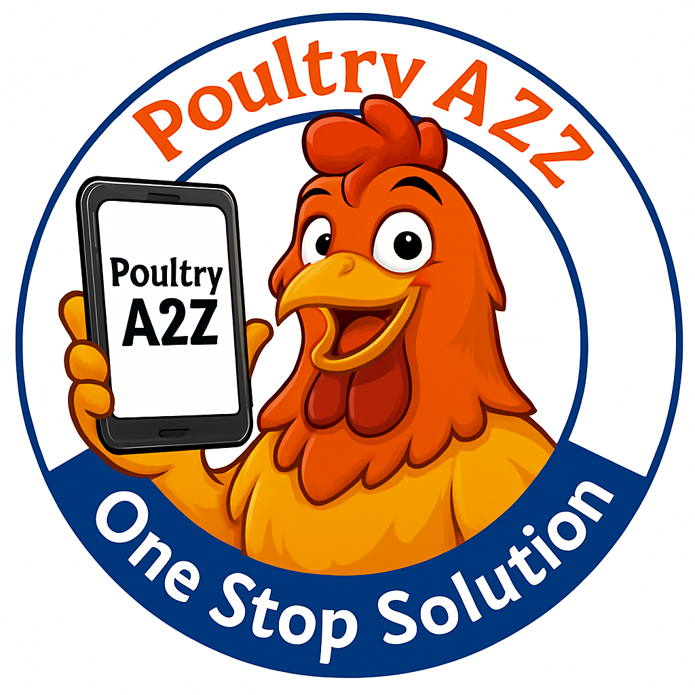

# Poultry A2Z - Complete Poultry Solutions



A comprehensive web application for poultry farming solutions, providing a complete marketplace for poultry products, services, and supplies.

## 🐔 About

Poultry A2Z is a modern, responsive web application designed to serve the poultry farming community. It offers a centralized platform for farmers, suppliers, and service providers to connect and conduct business efficiently.

## ✨ Features

### 🏪 **Product Catalog**
- **Comprehensive Categories**: Chemicals & Disinfectants, API & Pure Drugs, Chicks Supply, Fresh Chicken & Eggs
- **Service Offerings**: Certification Services, Cold Storage Solutions
- **Real-time Pricing**: Dynamic pricing with daily rate updates
- **Product Search & Filtering**: Easy navigation through extensive product listings

### 📱 **User Experience**
- **Responsive Design**: Optimized for desktop, tablet, and mobile devices
- **Interactive UI**: Modern interface with smooth animations and transitions
- **Real-time Updates**: Live pricing and inventory status
- **Contact Integration**: Direct WhatsApp, phone, and email contact options

### 🛠️ **Admin Panel**
- **Content Management**: Full CRUD operations for categories and products
- **Image Upload**: Support for both URL and file upload for product images
- **Data Management**: JSON-based data storage with export functionality
- **Analytics Dashboard**: Overview of products, categories, and inventory

### 🔧 **Technical Features**
- **Modern JavaScript**: ES6+ features with modular architecture
- **CSS Grid & Flexbox**: Advanced layout techniques for responsive design
- **Font Awesome Icons**: Professional iconography throughout the application
- **Local Storage**: Client-side data persistence for user preferences

## 🚀 Getting Started

### Prerequisites
- Modern web browser (Chrome, Firefox, Safari, Edge)
- Local web server (optional, for development)

### Installation

1. **Clone or Download** the project files
```bash
git clone <repository-url>
cd Poultry-A2Z
```

2. **Open the Application**
   - For basic usage: Open `index.html` in your web browser
   - For development: Use a local server (Live Server, Python HTTP server, etc.)

3. **Access Admin Panel**
   - Open `admin.html` in your browser
   - Use the admin interface to manage content

## 📁 Project Structure

```
Poultry A2Z/
├── index.html              # Main application page
├── admin.html              # Admin panel for content management
├── styles.css              # Main stylesheet
├── script-compatible.js    # JavaScript functionality
├── data.json              # Application data and configuration
├── Poultry_Logo.png       # Application logo
└── README.md              # Project documentation
```

## 🎯 Usage

### For End Users
1. **Browse Categories**: Explore different product and service categories
2. **View Products**: Click on categories to see detailed product listings
3. **Contact Suppliers**: Use integrated contact options (WhatsApp, phone, email)
4. **Check Pricing**: View current market rates and product prices

### For Administrators
1. **Access Admin Panel**: Open `admin.html`
2. **Manage Categories**: Add, edit, or delete product categories
3. **Product Management**: 
   - Add new products with images and descriptions
   - Update pricing and inventory status
   - Upload product images (URL or file upload)
4. **Export Data**: Download updated JSON configuration

## 🏢 Business Categories

### Products
- **Chemicals & Disinfectants**: Farm sanitization solutions
- **API & Pure Drugs**: Pharmaceutical products for poultry health
- **Fresh Chicken & Eggs**: Daily fresh poultry products

### Services
- **Certification**: ISO, HACCP, and Organic certifications
- **Cold Storage**: Temperature-controlled storage solutions

### Supplies
- **Chicks Supply**: Day-old chicks from certified hatcheries

## 🛠️ Technical Implementation

### Frontend Technologies
- **HTML5**: Semantic markup with accessibility features
- **CSS3**: Modern styling with Grid, Flexbox, and animations
- **JavaScript (ES6+)**: Modular, event-driven architecture
- **React (Admin Panel)**: Component-based admin interface

### Data Management
- **JSON-based Storage**: Lightweight, portable data format
- **Base64 Image Encoding**: Self-contained image storage
- **Local Storage**: Client-side preference management

### Responsive Design
- **Mobile-First Approach**: Optimized for all screen sizes
- **CSS Grid Layout**: Advanced responsive layouts
- **Touch-Friendly**: Optimized for mobile interactions

## 🔧 Configuration

### Site Configuration
Edit `data.json` to customize:
- Site title and tagline
- Base pricing and currency
- Contact information
- Featured categories

### Adding New Categories
Use the admin panel or manually edit `data.json`:
```json
{
  "id": "category-id",
  "title": "Category Name",
  "description": "Short description",
  "category": "products|services|supplies",
  "featured": true|false,
  "image": "image-url-or-base64",
  "products": [...],
  "contact": {...}
}
```

## 📱 Contact Integration

The application includes integrated contact methods:
- **WhatsApp**: Direct messaging with pre-filled text
- **Phone**: Click-to-call functionality
- **Email**: mailto links with subject lines

## 🎨 Customization

### Styling
- Modify `styles.css` for visual customization
- CSS custom properties for easy theme changes
- Responsive breakpoints for different devices

### Functionality
- Extend `script-compatible.js` for additional features
- Add new product categories in `data.json`
- Customize contact methods and pricing logic

## 🔒 Security Considerations

- **Client-Side Application**: No server-side vulnerabilities
- **Data Validation**: Input sanitization in admin panel
- **Image Upload**: Base64 encoding prevents file system access
- **Contact Privacy**: No sensitive data stored locally

## 🚀 Deployment

### Static Hosting
Deploy to any static hosting service:
- **GitHub Pages**: Free hosting for public repositories
- **Netlify**: Drag-and-drop deployment
- **Vercel**: Git-based deployment
- **Traditional Web Hosting**: Upload files via FTP

### Local Development
```bash
# Using Python
python -m http.server 8000

# Using Node.js
npx serve .

# Using PHP
php -S localhost:8000
```

## 🤝 Contributing

1. Fork the repository
2. Create a feature branch (`git checkout -b feature/AmazingFeature`)
3. Commit your changes (`git commit -m 'Add some AmazingFeature'`)
4. Push to the branch (`git push origin feature/AmazingFeature`)
5. Open a Pull Request

## 📄 License

This project is licensed under the MIT License - see the [LICENSE](LICENSE) file for details.

## 📞 Support

For support and inquiries:
- **Email**: contact@poultrya2z.com
- **Phone**: +91-9876543210
- **WhatsApp**: +91-9876543210

## 🙏 Acknowledgments

- **Font Awesome** for the icon library
- **Unsplash** for placeholder images
- **React** for the admin panel framework
- **Modern CSS** techniques for responsive design

---

**Poultry A2Z** - *Your Complete Poultry Solution Partner* 🐔